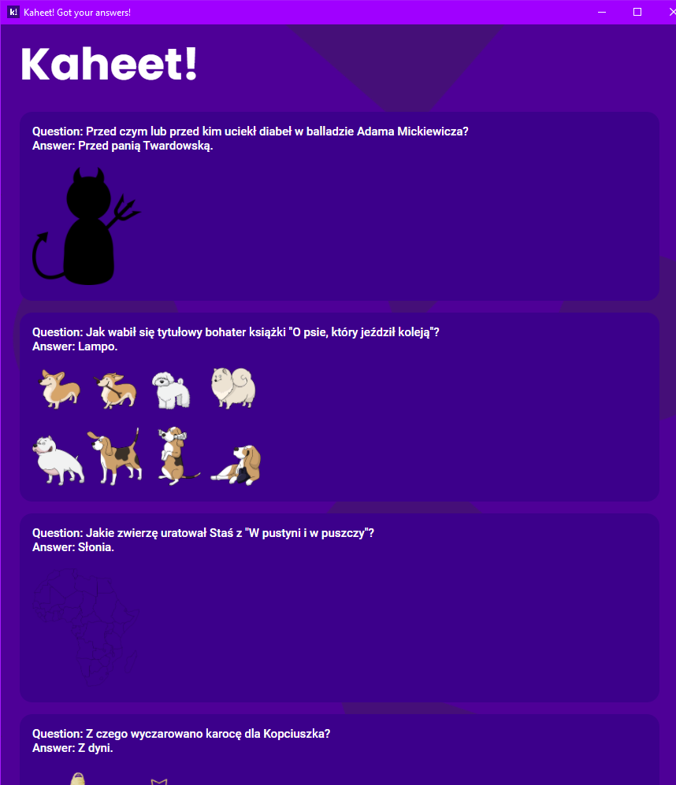
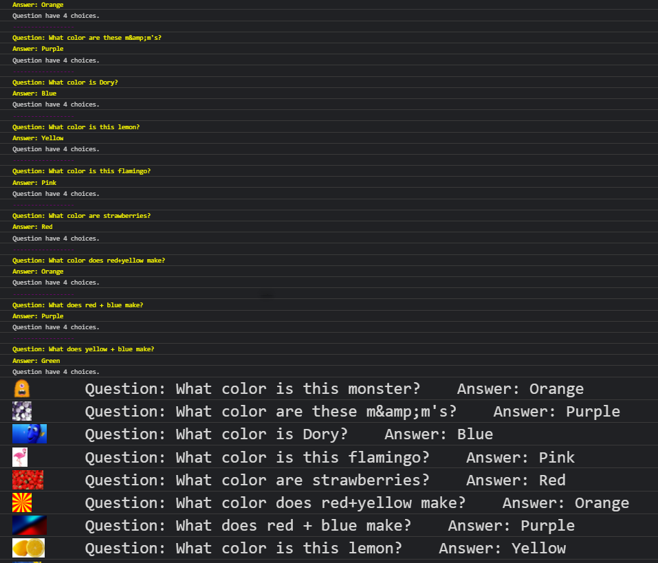

# kaheet-kahoot-cheat
There are 2 versions of cheat:
1. [Software: nice and simple gui](#Download "Goto Download")
2. [Script: console version](#Console "Goto Console")

* [Bugs](#Bugs "Goto Bugs")

# Download
[Download](https://schoolcheats.pxtrez.repl.co/cheats/) kaheet!<br><br>
<details><summary>GUI</summary>
<br><br>
</details>


or


## Console
1. Open [kahoot](https://kahoot.it/)
2. Right click, inspect (open console)
3. Paste this:

```js
fetch("https://raw.githubusercontent.com/pxtrez/kaheet-kahoot-cheat/main/dist/script.js")
.then((res) => res.text()
.then((t) => eval(t)))
```

4. Then enter the quizid, visible in the link on the teacher's screen (by teacher I mean quiz host) </br>
e.g. `https://play.kahoot.it/v2/lobby?quizId=` **`4487beab-3d31-4e9e-8d94-94ef15f87230`**
5. Correct answers should appear in the console. </br></br></br>
</br></br></br>

cheat supports images in kahoot quizzes!

## Bugs
- 

## Other
Pull requests are welcome!
